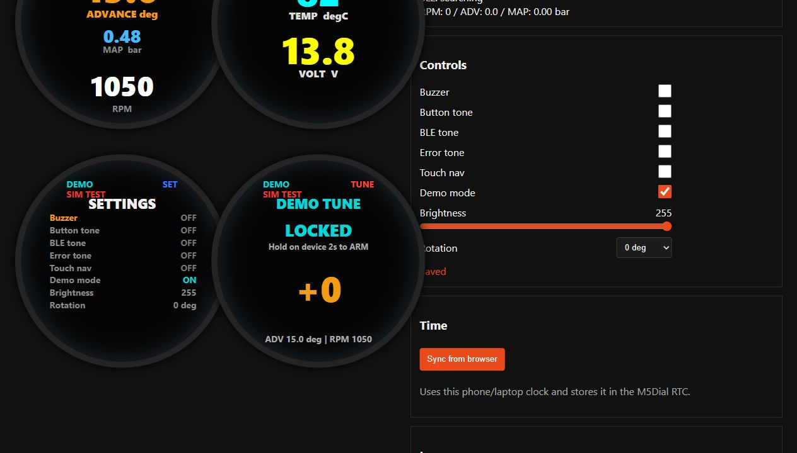

# M5Dial 123Tune - Release-Staende 2026-05-23

Dieses Dokument haelt fest, welcher Stand wirklich als stabiler Meilenstein
benutzt wurde und welche Funktionen noch auf dem M5Dial getestet werden
muessen. Damit kann spaeter auch ein anderer Entwickler oder eine andere AI
ohne verlorene Zwischenschritte weiterarbeiten.

## v0.1.0-core - BLE, Logging und geschuetzter Tune-Test

Git-Referenz: `aabc290`

Dieser Stand bildet die stabile Basis:

- BLE-NUS-Verbindung zur 123Tune+ und Live-Telemetrie.
- Anzeige von Zuendwinkel, MAP, RPM sowie Temperatur und Spannung.
- CSV-Fahrtlogging ab `RPM > 650` mit Zeitstempel.
- RTC-Unterstuetzung (BM8563) und Zeitsynchronisation.
- Read-only Abruf der 123Tune-Kurvendaten per Long-Press.
- Vorhandene temporare Live-Tune-Kommandos mit `tune_arm`-Sperre; kein
  permanentes Schreiben einer Zuendkurve.

## v0.2.0-webgui - Webansicht und Download

Git-Referenz: `e329b8d`

Dieser Stand erweitert die Basis um die im Fahrzeug hilfreiche Kontrolle:

- Mini-WebGUI ueber Home-WLAN oder Setup-AP.
- Browser-Spiegel fuer Hauptanzeige und Temperatur/Spannung.
- Download der internen CSV-Logs ohne Laptop am Fahrzeug.
- WLAN-Setup, WPS-Versuch und Browser-Zeitsynchronisation.
- Live-Tune-Protokoll ist vorhanden, bleibt aber eine bewusst geschuetzte
  Testfunktion.

## v0.3.0-ui Kandidat - Bedienung und Tune-Sicherheit

Status: kompiliert, auf `COM4` geflasht sowie WebGUI und ARM-Timeout geprueft.
Der erste Fahrtest am 2026-05-23 hat drei Blocker gezeigt; dieser Kandidat
wird deshalb nicht als Release freigegeben:

- Ein Touch auf der drueckbaren Displayflaeche konnte zusaetzlich zum
  Encoder-Button eine Seite weiter schalten und dadurch die Bedienung im
  `SETTINGS`-Menue stoeren.
- Der Buzzer konnte dadurch in der Fahrt nicht verlaesslich stumm geschaltet
  werden.
- Ohne erreichbares Home-WLAN erschienen fortlaufend `WiFi retry...`-Meldungen
  im Fahrbetrieb.

Aktuelle WebGUI des geflashten Kandidaten mit aktivem Stand-Demo:

Neue Funktionen im aktuellen Entwicklungsstand:

- Vier M5Dial-Seiten: `ADV`, `T/V`, `SETTINGS`, `TUNE`.
- Vier entsprechende Live-Spiegel in der WebGUI.
- Touch-Tap zum Seitenwechsel zusaetzlich zum Encoder-Druck.
- Buzzer mit gespeichertem Master-Schalter sowie Button-, BLE- und
  Fehlerton-Schaltern.
- Einstellbare Display-Helligkeit im Settings-Menue.
- BLE-Suche mit Pausen-Backoff bei ausgeschalteter/nicht gefundener 123Tune+,
  damit das Dial im Stand nicht ununterbrochen aktiv scannt.
- Eigene rote `LIVE TUNE`-Seite mit zweistufiger Freigabe:
  `HOLD 2s ARM`, danach `HOLD 2s START`.
- ARM-Timeout nach 30 Sekunden, Begrenzung auf `+/-10` Schritte und
  gesicherter Hold-Exit ueber Rueckstellung auf `0`.
- Solange Tune live ist, bleibt die Warnseite sichtbar und kann nicht
  versehentlich weggeblendet werden.

## v0.3.1-bugfix Kandidat - ruhiger Fahrbetrieb

Ziel dieses Stands ist eine unaufdringliche, sichere Basis fuer den naechsten
Test mit laufendem Motor:

- Alle Toene werden beim ersten Boot dieses Fixes auf `OFF` migriert:
  `Buzzer`, `Button tone`, `BLE tone` und `Error tone`.
- `Touch nav` ist standardmaessig `OFF`. Wird es spaeter bewusst aktiviert,
  darf ein Tap nur noch zwischen `ADV` und `T/V` wechseln; `SETTINGS` und
  insbesondere `TUNE` sind ueber Touch nicht erreichbar.
- Die Settings-Seite zeigt den neuen Schalter `Touch nav`.
- Solange der Motor steht (`RPM <= 650`), kann das M5Dial Home-WLAN suchen
  beziehungsweise den Setup-AP anbieten.
- Steigt die Drehzahl ueber `650 RPM`, bevor Home-WLAN verbunden ist, wird
  WiFi/AP still abgeschaltet. Es gibt waehrend dieser Fahrt keine
  `WiFi retry...`-Schleife und keinen Setup-AP im Hintergrund.
- Bei `RPM > 650` werden auch Web- und serielle WLAN-Setup-Aktionen
  (`Save WiFi`, `WPS`, `wifi`, `wifi_static`, `wifi_ap`) blockiert;
  `wifi_off` bleibt als Not-Aus verfuegbar.
- Diagnose-/Notfallbefehle per USB: `ui_status`, `buzzer_off`, `touch_off`,
  `wifi_status`, `wifi_off` und `wifi_ap` (AP nur bei `RPM <= 650`).
- Sicherer `Demo mode` fuer Tests im Stand:
  - Einstieg ueber `SETTINGS` oder USB `demo_on`.
  - Simulierte Werte fuer `ADV`, `RPM`, `MAP`, Temperatur und Spannung.
  - Ein- und Ausstieg fuehren zurueck auf die sichere `ADV`-Hauptseite.
  - Display-Taps wechseln im Demo-Modus automatisch durch alle Seiten,
    ohne `Touch nav` fuer den Fahrbetrieb dauerhaft zu aktivieren.
  - `DEMO TUNE` testet ARM, +/- und Exit rein visuell, ohne BLE-Kommando.
  - Keine CSV-Fahrtlogs und keine WiFi-Fahrtabschaltung durch Demo-RPM.
  - Nicht persistent; automatisch aus bei realer BLE-Verbindung oder Neustart.
- Neues `Rotation`-Setting: dreht die Anzeige in Schritten `0/90/180/270 deg`
  relativ zur bisherigen Einbaulage und speichert die Auswahl.
- Die WebGUI erhaelt ein zusaetzliches `Controls`-Feld fuer Buzzer-/Ton-
  Schalter, `Touch nav`, `Demo mode`, Helligkeit und Rotation. Bei realen
  `RPM > 650` sind nur noch sichere `OFF`-Aktionen erlaubt.

## Bedienung des Kandidaten

| Aktion | Funktion |
| --- | --- |
| Encoder kurz druecken | Naechste Display-Seite; in `SETTINGS` aktuellen Punkt ändern |
| Display antippen | Normal mit `Touch nav ON` nur `ADV` / `T/V`; im Demo-Modus alle Seiten |
| Long-Press auf `ADV` oder `T/V` | Read-only Kurvenabruf |
| Drehen in `SETTINGS` | Einstellung auswaehlen |
| Long-Press in `SETTINGS` | Settings verlassen / naechste Seite |
| `Demo mode` in `SETTINGS` aktivieren | Sicheren Standtest mit simulierten Live-Werten starten |
| `Rotation` in `SETTINGS` aktivieren | Display-Lage um weitere `90 deg` drehen und speichern |
| Long-Press 2 s in `TUNE` (LOCKED) | Tune nur vorbereiten (`ARMED`) |
| Long-Press 2 s in `TUNE` (ARMED) | Live-Tune starten |
| Drehen in `TUNE` (LIVE) | Zuendwinkel temporaer schrittweise +/- |
| Long-Press 2 s in `TUNE` (LIVE) | Auf 0 zurueckstellen und Tune verlassen |

## Pruefung vor v0.3.0 Release

- [x] Flash auf das M5Dial (`COM4`).
- [x] WebGUI aufrufen und alle vier Spiegel auf Ueberlagerungen pruefen.
- [x] Tune nur armen und Auto-Timeout ohne BLE/Zuendbefehl pruefen.
- [x] BLE-Scan ohne Zuendung pruefen: 10-s-Fenster mit Pausen 5/10/20 s bestaetigt.
- [x] Erste Fahrt pruefen; Touch/Buzzer/WiFi-Blocker fuer `v0.3.1` aufgenommen.
- [x] `v0.3.1` auf `COM4` geflasht; API/Web-Spiegel zeigen alle Toene und
  `Touch nav` direkt nach dem Boot auf `OFF`.
- [x] `v0.3.1`: Demo-Modus auf `COM4` geprueft: simulierte Werte,
  Web-Status, lokales Tune ohne BLE-TX und Rueckkehr `DEMO OFF` auf `ADV`.
- [x] `v0.3.1`: Display-Drehung per USB-Diagnose auf `COM4` durch
  `0/90/180/270 deg` geprueft und anschliessend auf `0 deg` zurueckgesetzt.
- [ ] `v0.3.1`: `Rotation` direkt im `SETTINGS`-Menue am Display optisch pruefen.
- [x] `v0.3.1`: Web-Controls auf dem geflashten M5Dial geprueft; Toene und
  normales `Touch nav` auf `OFF`, `Demo mode` fuer den Handtest bereit.
- [ ] `v0.3.1`: Im Demo-Modus Display-Tap durch `ADV`, `T/V`, `SETTINGS`
  und `DEMO TUNE` direkt am Geraet pruefen.
- [ ] Bedien- und Aktivierungskonzept fuer echtes `LIVE TUNE` separat
  abstimmen; bis dahin bleibt die Live-Funktion unveraendert.
- [ ] Sichtkontrolle aller vier Seiten direkt auf dem runden M5Dial-Display.
- [ ] `v0.3.1`: Ton-Migration `OFF`, Settings-Bedienung und Touch-Sperre testen.
- [ ] `v0.3.1`: ohne Home-WiFi bei `RPM > 650` ruhiges WiFi-Off pruefen.
- Tune zunaechst nur bei stehendem Motor bzw. sicherem Pruefzustand:
  ARM/Timeout/Verlassen pruefen, bevor ein Live-Fahrtest erfolgt.
- Erst nach dieser Pruefung den Kandidaten als freigegebenen Release taggen.
